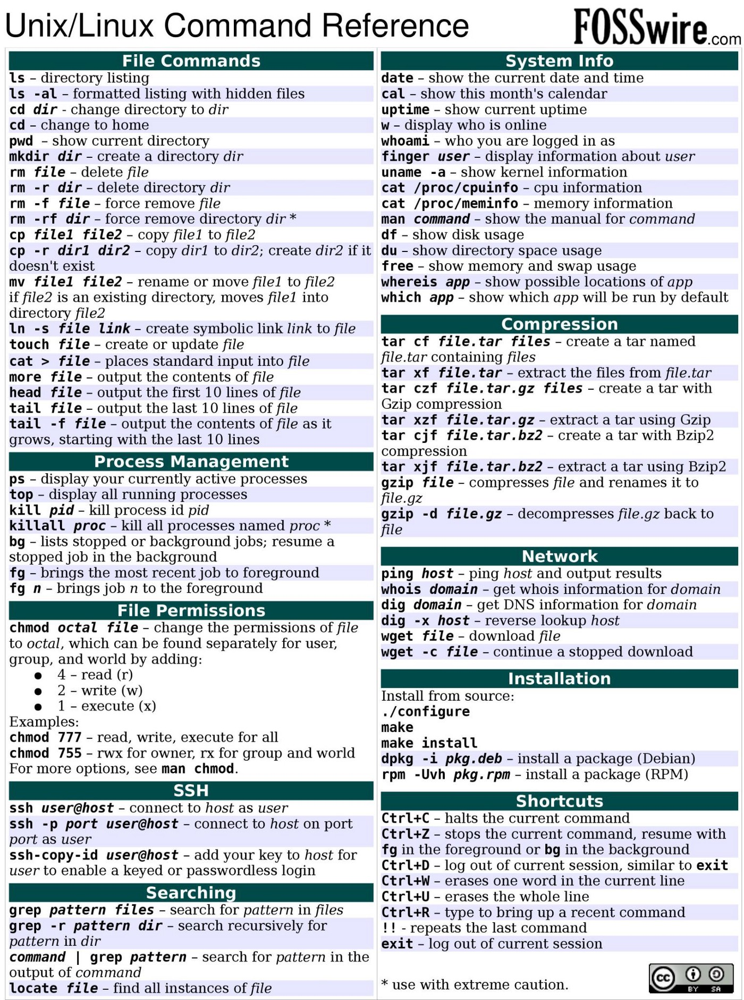

Analysis of transcriptomics on SAGA
================
Marius Saltvedt
9/28/2021

-   [1 UNIX](#unix)
    -   [1.1 View text files  
        ](#view-text-files-)
    -   [1.2 Edit text files  
        ](#edit-text-files-)
    -   [1.3 Display a nice table  
        ](#display-a-nice-table-)
    -   [1.4 See disk usage of files  
        ](#see-disk-usage-of-files-)
    -   [1.5 Change filename  
        ](#change-filename-)
    -   [1.6 Write search hits to files  
        ](#write-search-hits-to-files-)
    -   [1.7 File order and length of files  
        ](#file-order-and-length-of-files-)
    -   [1.8 # of elements  
        ](#-of-elements-)
    -   [1.9 For-loop and multiple file changes  
        ](#for-loop-and-multiple-file-changes-)
    -   [1.10 Plate reader data  
        ](#plate-reader-data-)
    -   [1.11 Common unix commands  
        ](#common-unix-commands-)

# 1 UNIX

  
  

## 1.1 View text files 

Use `more` or `less` command followed by filename to view text-files  
  

## 1.2 Edit text files 

`vim` to edit text file  

-   press `i` to insert, start writing
-   press`esc` followed by `:` to insert command
-   press `:wq` to write and quit
-   press `:q` or `:q` to quit or forcequit without saving  
      

## 1.3 Display a nice table 

`column -t` will help display a nice table, but if it is a long table
you can choose to display only some of it by using the `head` command,
followed by number of rows (by default its only 10 rows).

    <tablefile head -n 100 | column -t

  

## 1.4 See disk usage of files 

    du -sh filename

  

## 1.5 Change filename 

You can use the `mv` command to both just change filename, and use it to
mve files from one location to another. Below I have just shown an
example of changing the filename of an existing file.

    mv file.txt new_file.txt

  

## 1.6 Write search hits to files 

There are several ways you can search and retrieve specific information
from a file, but the `grep` command is commonly used. If you want
specific row numbers you can use `sed`. You can save the results to
another textfile by using `search > filename`. However, this will
overwrite anything existing in this file. You can append the search to
this file by using two `>>` instead.  

This find line 7 to 10 in the test.csv file and then append to test.txt
file.

    sed -n '7,10p' test.csv >> test.txt

  

## 1.7 File order and length of files 

While being in a directory you can save everything in that directory as
an object. Below we have called that object `files`, where the `(*)`
symbolise to save everything in `pwd`. To call this object you must use
`$` prior to the name. Any element of an array may be referenced using
following syntax: `${ArrayName[subscript]}`. You can also make up an
array `ArrayName=("element 1" "element 2" "element 3")`. Lets imagine
that `files` contain `files=("1_data" "2_analysis" "3_script")`. Now we
can display anything in the object `files` by using the order of them
(starting with 0 as the first element).

    files=(*)

    echo "${files[0]}" #will print 1_data
    echo "${files[2]}" #will print 3_script

  

## 1.8 # of elements 

If you need to know how many elements that are present in your object
you can use `${#ArrayName[@]}`

    echo ${#files[@]} 

    #will print out the number 3
    # Because it contains three elements (1_data 2_analysis 3_script)

  

If subscript is `@` or `*`, the word expands to all members of name. By
prefixing `#` to variable you will find length of an array (i.e number
of elements). Now we can use bash for loop to read or print values from
`$files`:

    # define it
    files=("1_data" "2_analysis" "3_script")
     
    # get length of $distro array
    len=${#files[@]}
     
    # Use bash for loop 
    for (( i=0; i<$len; i++ )); do echo "${files[$i]}" ; done

    # Print from for-loop
    1_data
    2_analysis
    3_script

This for-loop will the run through every element position in `files` and
echo/print this for this position. If you also add `; echo $i;` you will
see that `$i` is just a number and will start with i=0, then 1 and then
2 since we only have three elements.  
  

## 1.9 For-loop and multiple file changes 

Create a for-loop that makes changes to all files in a folder:  

This for-loop will find all csv files, copy this csv file and change the
file extension to txt instead while keeping the original name of the
file. If you want to just replace the original file with the new
extension you can just replace `cp` with `mv`.

    for i in *.csv; do 
    cp -- "$i" "${i%.csv}.txt"; 
    done

  

## 1.10 Plate reader data 

Make a for-loop for extracting data from several folders  

Below I have made a for-loop within a for-loop that will help you go
into multiple folders and within each folder copy specific rows from
every file in that folder. The code is designed specifically for plate
reader data where you will have multiples folders containing the date of
the read, and within each of these folders you will have all your files
from the plate reader that day. This code will extract all the data from
specified row numbers and save the folder name, the file name and the
data from these rows into one csv file.  

In order to run the code you must first change directory `cd` to the
folder that contains all the dated folders from the plate reader. If you
type `ls` you will see something like this:
`20210908 20210910 20210913 20210916`.  

Depending on if you have a 24-well plate or a 96-well plate you need to
change one line below noted with three hashtags `###` with one of the
two first lines below.

    # sed -n '7,11p' "${files[$i]}" >> ./../Plate_reader.csv; #24-well plate
    # sed -n '7,15p' "${files[$i]}" >> ./../Plate_reader.csv; #96-well plate

    for f in 2021*; do
    BACK=$(pwd);
    cd $f;
    var=$(pwd);
    basename $(pwd);
    mydir="$(basename $PWD)";
    echo "### $mydir ###" >> ./../Plate_reader.csv;
    files=(*);
    len="${#files[@]}";
    for (( i=0; i<$len; i++ )); do
    echo "${files[$i]}" >> ./../Plate_reader.csv;
    sed -n '7,15p' "${files[$i]}" >> ./../Plate_reader.csv; ###CHANGE THIS LINE###
    echo "${files[$i]}"
    done;
    cd $BACK; 
    done

  
  
  

## 1.11 Common unix commands 

  
  
  
